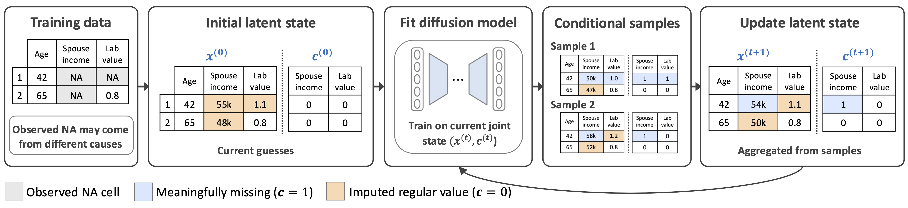

# Learning What Not to Impute: An Uncertainty-Aware Diffusion Framework for Meaningful Missingness

  

Project repository for **Learning What Not to Impute: An Uncertainty-Aware Diffusion Framework for Meaningful Missingness**.

This paper introduces **Diff-Joint**, an uncertainty-aware diffusion framework for selective imputation. Instead of imputing all missing entries, Diff-Joint aims to distinguish **meaningfully missing** entries, which should be preserved as missing, from **observation-induced missing entries**, which should be imputed.

## Code Release

We will release the implementation, running scripts, and reproduction instructions in this repository soon.

## Citation

Citation information will be added soon.